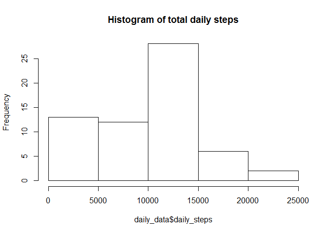
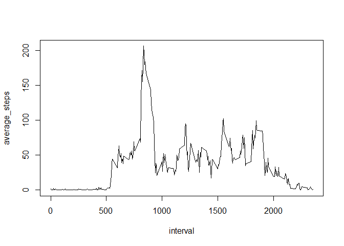
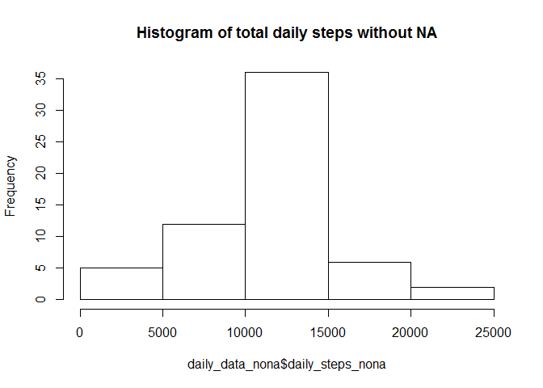
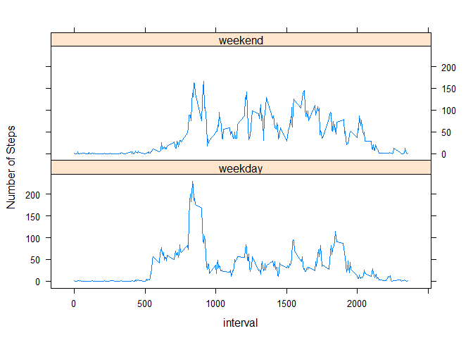

# Reproducible Research: Peer Assessment 1


## Loading and preprocessing the data

```r
library(plyr)
raw_data <- read.csv("activity.csv")
daily_data <- ddply(raw_data,~date,summarise,daily_steps=sum(steps, na.rm = TRUE))
```

## What is mean total number of steps taken per day?
First here is the Histogram of the total daily steps:

```r
hist(daily_data$daily_steps, main = "Histogram of total daily steps")
```

<!-- -->

Calculate mean and SD of total daily steps:


```r
mean_median <- summarise(daily_data, mean = mean(daily_steps), median = median(daily_steps))
mean <- as.integer(mean_median$mean)
median <- mean_median$median
```


### The mean total daily steps is: 9354   
### The median of total daily steps is: 10395  

  
  
## What is the average daily activity pattern?
To create a summary data frame which contains the average number of steps  
in each interval, across all days and plot the result:

```r
interval_data <- ddply(raw_data,~interval,summarise,average_steps=mean(steps, na.rm = TRUE))
plot(interval_data,type = "l")
```

<!-- -->

```r
max_int <- interval_data[interval_data$average_steps == max(interval_data$average_steps), 1]
```

### The 5-minute interval, on average across all the days in the dataset,  
### which contains the maximum number of steps is: 835  

  
  
## Imputing missing values
Calculating the total number of missing values in the dataset:


```r
mis_val <- length(raw_data$steps[raw_data$steps == "NA"])
```
  
### The total number of missing values in the dataset is: 2304
  
Replacing NA values with the mean value for the corresponding interval:  

```r
interval_data$average_steps <- as.integer(interval_data$average_steps)
raw_data_nona <- merge(raw_data, interval_data[, c("interval", "average_steps")], by="interval")
my.na <- is.na(raw_data_nona$steps)
raw_data_nona$steps[my.na] <- raw_data_nona$average_steps[my.na]
```
  
  
Recalculating number of daily steps and showing this as histogram:


```r
daily_data_nona <- ddply(raw_data_nona,~date,summarise,daily_steps_nona=sum(steps, na.rm = TRUE))
hist(daily_data_nona$daily_steps_nona, main = "Histogram of total daily steps without NA")
```

<!-- -->
  
  
Calculate mean and SD of total daily steps:


```r
mean_median_nona <- summarise(daily_data_nona, mean = mean(daily_steps_nona), median = median(daily_steps_nona))
mean <- as.integer(mean_median$mean)
median <- mean_median$median
```


### The mean total daily steps without "NA" is: 9354   
### The median of total daily steps without "NA" is: 10395  

There is no difference between the mean and median of the data set with NA values and those of the dataset with the replaced values. This is due to the fact that the NA values were replaced by the average number of steps for every interval, across all days.  


## Are there differences in activity patterns between weekdays and weekends?  
Creating a new data set which is similar to the "No NA" data set, with the addition of a new
factor variable. This variable categorizes each date as either "weekday" or "weekend":  

```r
wkday_wkend <- function(x) { if(weekdays(as.Date(as.character(x))) %in% c("Saturday", "Sunday")) {x <- "weekend"} else x <- "weekday"}
data_wkday <- raw_data_nona
data_wkday$wkday_wkend <- data_wkday$date
data_wkday$wkday_wkend <- lapply(data_wkday$wkday_wkend,wkday_wkend)
data_wkday$wkday_wkend <- as.factor(as.character(data_wkday$wkday_wkend))
```

To create a summary data frame which contains the average number of steps  
in each interval, across all days and plot the result, with a separate plot for weekdays and for weekends:

```r
library(lattice)
library(dplyr)
interval_data_wkday <- data_wkday %>% group_by(interval, wkday_wkend) %>% summarise(average_steps=mean(steps))
xyplot(interval_data_wkday$average_steps ~ interval_data_wkday$interval | interval_data_wkday$wkday_wkend, layout = c(1,2), type = "l", xlab = "interval", ylab = "Number of Steps")
```

<!-- -->
